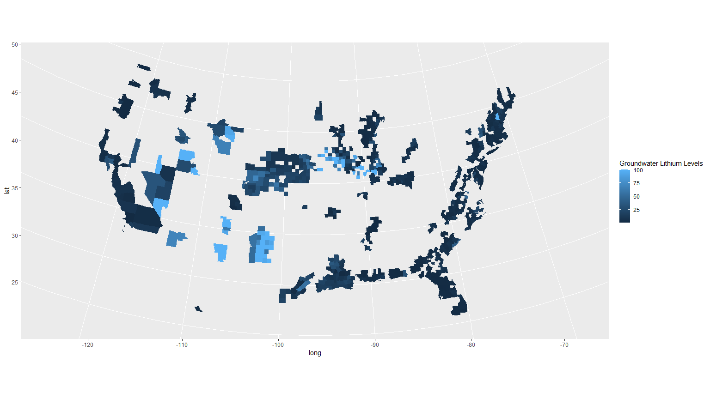
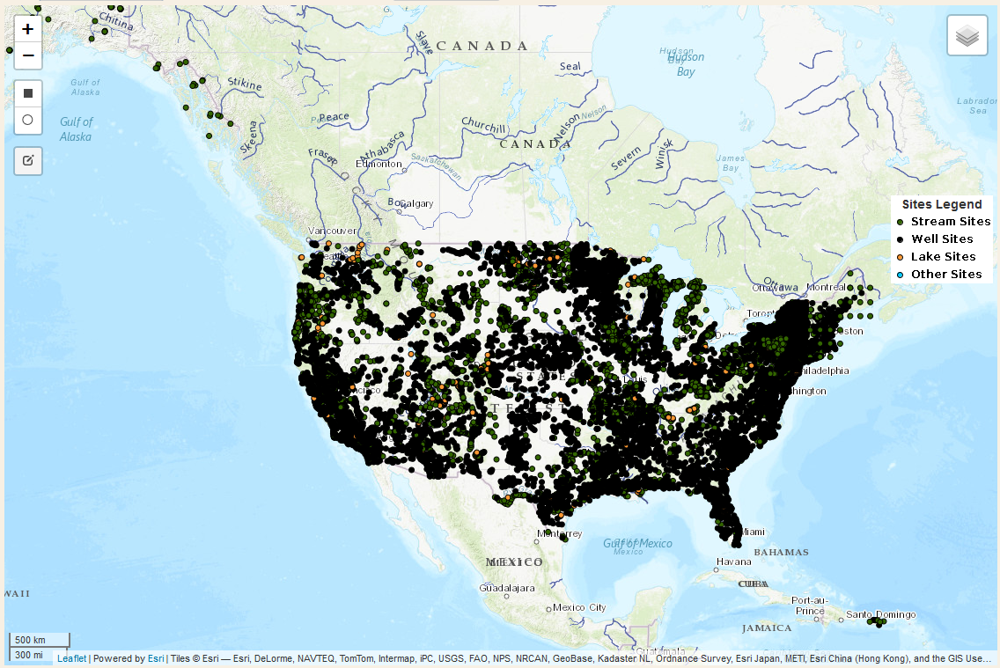

A Quick and Incomplete County-Level Lithium Plot
================

## Quick & Dirty Plot

Source of data for these plots available
[here](https://psycheducation.org/treatment/mood-stabilizers/the-big-three-for-bipolar-depression/lithium/how-much-lithium-in-my-water/).

Note that these plots are top-coded. The average for counties reporting
100 mcg/L actually extend up to \~650 mcg/L.

<!-- -->

## Plan for Slow and Painful Plots

