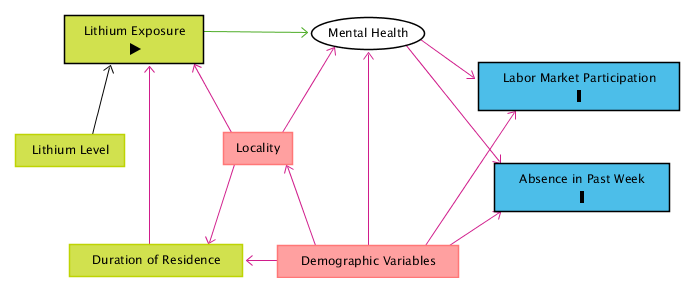

## Abstract

Lithium in groundwater is correlated with lower rates of suicide. I investigate whether higher lithium levels in groundwater affect measures of labor market participation. I find small but significant reductions in the rate of unemployment among those in the labor force, the rate of labor force participation, the rate of looking for work among those not working, and the rate of having worked in the previous year.

## Introduction

Lithium has been used as a treatment for bipolar disorder for over sixty years. A growing corpus has found correlative evidence that its presence in areas' groundwater (in much lower concentrations than those used psychiatrically) is associated with decreased rates of suicide in those areas [@barjastehaskari2020]. If truly present, the mechanism for this is unknown, though it is hypothesized that lithium may have a mood-regulating effect that tempers people's strongest emotional responses. If this hypothesis is true, the ingestion of trace amounts of lithium may also prevent the occurence of other events caused by heightened emotional responses, such as being fired or missing work for mental health reasons.

In this project, I estimate the causal relationship of lithium in groundwater on labor market outcomes plausibly affected by the purported emotion-regulating effects of lithium.


## Methods

### Data Used

I linked data from three sources.

This project requires average lithium concentrations at the level of Public-Use Microdata Areas (PUMAs). I used geospatial vector data to define the boundaries of these areas: the US Census Bureau's county shapefiles for counties and IPUMS-USA GIS Boundary Files for PUMAs. For lithium concentrations in groundwater, I used data from the United States Geological Survey (USGS) Water Quality Portal from 1995 to present. It includes almost 100,000 lithium measurements in 2040 out of 3142 counties and 1573 out of 2351 PUMAs. For the outcome variables and the covariates used for the matching procedure, I used the IPUMS American Community Survey (ACS) data. I selected the yearly samples between the years 2011 and 2018. The data is limited to these samples because these are the samples for which the variable recording a consistent PUMA of residence is available. The subset of the data that had responses for each of the covariates used for matching contained over 8,000,000 observations.

### Lithium Level Interpolation

The measurements taken at each site are not identical. Consequently, I used the average measurement at each site when calculating average lithium level in groundwater for a county or PUMA to avoid excessively weighting sites at which more measurements happen to be taken. To arrive at an average exposure per county or PUMA, I generated a grid of points over the entirety of the United States and used a modification of Shepard’s method of inverse distance weighting (IDW) to interpolate the lithium level at each of those points [@desmith2018]. The formula for the interpolated lithium value $z_j$ at grid-point $j$ is given by $$z_{j} = \Bigg(\sum_{i=1}^n\Big(\frac{R-d_{ij}}{R \cdot d_{ij}}\Big)^2 \Bigg)^{-1} \cdot \sum_{i=1}^n z_i\Big(\frac{R-d_{ij}}{R \cdot d_{ij}}\Big)^2,$$ where $i$ corresponds to one of the $n$ lithium measurement sites within 100 kilometers of grid-point $j$, $d_{ij}$ is the distance between grid-point $j$ and measurement site $i$, amd $R$ is the maximum distance between grid-point $j$ and any of the set of measurement sites within 100 kilometers.

This interpolation procedure deserves some scrutiny, since it ignores the geohydrological processes by which lithium enters and spreads through an area's groundwater. Though there is no theoretical basis for the use of IDW to interpolate trace concentrations of substances in groundwater, more rigorously estimating the lithium levels in groundwater across the entirety of the United States is infeasible given the time constraints on this project and my utter lack of expertise in this area. Moreover, this procedure is used by the professional software package Groundwater Modeling System [@desmith2018], which indicates that its accuracy may be sufficient for aggregation at the county- or PUMA-level. Collaboration with a specialist in groundwater hydrology might assist in the quantification of uncertainty associated with and inaccuracy introduced by this interpolation method.

```{r setup, include=F}
library(tidyverse)
library(sf)
library(data.table)

#####################
# import shapefiles #
#####################

# load PUMA shapefiles
pumas = st_read("../data/ipums_usa_data/geographic/ipums_puma_2010/ipums_puma_2010.shp")

# remove non-state PUMA shapes
pumas = subset(pumas, as.numeric(as.character(STATEFIP)) <= 56)

#######################
# import lithium data #
#######################

# read lithium data
interpolated_lithium_values = as.data.frame(read.csv("../data/lithium_water_data/interp_values.csv", 
                                                              stringsAsFactors = FALSE))
# turn geometry back into coordinates
coords_flat = unlist(strsplit(substr(interpolated_lithium_values$geometry, 3, nchar(interpolated_lithium_values$geometry) - 1), ', '))
interpolated_lithium_values$longitude = as.numeric(coords_flat[1:length(coords_flat)%%2 == 1])
interpolated_lithium_values$latitude = as.numeric(coords_flat[1:length(coords_flat)%%2 == 0])

# make sf object for "contains" calculation
interpolated_lithium_values_sf = st_as_sf(interpolated_lithium_values, coords = 3:4, crs = st_crs(pumas))

#################################
# calculate PUMA lithium levels #
#################################

# run contains calculation for average lithium level calculation below
grid_in_puma_list = st_contains(pumas, interpolated_lithium_values_sf)

# calculate average lithium level in each PUMA
for(puma_number_local in seq(nrow(pumas)))
{
  grid_points_in_puma = interpolated_lithium_values_sf[unlist(grid_in_puma_list[puma_number_local]),]
  pumas[puma_number_local, 'lithium_value'] = mean(grid_points_in_puma$lithium_value, na.rm = T)
}
```

The results from this interpolation and averaging procedure are presented below.

```{r lithium_map, echo=F, warning=F}
ggplot(data = pumas) +
  geom_sf(aes(fill = lithium_value, color = lithium_value))
```


### Directed Acyclical Graph Model

Figure 1 presents a directed acyclical graph that models the causal relationships relevant to this research. The entity "Demographic Variables" includes variables such as age, sex, race, marital status, urban status, region, education level which have a complex internal structure of causal relationships. The most questionable decision in the model presented is probably the lack of a causal relationship between any outcome variables and "Duration of Residence".



In order to close the backdoor paths, I condition on those variables grouped under "Demographic Variables".

This model was used with a research design of one-to-one exact matching on observables to identify the effect of lithium exposure on five labor market outcomes: employment, labor force participation, whether a person worked in the year prior to the survey, whether a person looked for work in the week prior to the survey, and whether the person had worked in the week prior to the survey. Those surveyed who live in an area with high lithium levels in groundwater are considered treated; those surveyed who live in an area with low lithium levels are considered untreated. Crucially, these people are matched on the duration of residence in the PUMA.

I assume that the decision to move to an area is independent of the mental health outcomes associated with living in that area and that a person who moves is equally likely to move to a PUMA with low or high levels of lithium after conditioning on observables. This is the conditional independence assumption -- one of the identifying assumptions of matching on observables. I think it is unlikely that the cumulative effect of lithium in drinking water is large enough to influence a person's decision to move to a place with higher levels.


### Defining the Treatment

Deciding where to split the continuous variable of lithium concentration into a treatment level or an untreated level is somewhat thorny. According to the interpolation and averaging method I used to determine the mean exposure to lithium in each locality, the median PUMA has a mean lithium level of 14 mcg/L and the mean PUMA has a mean lithium level of 23 mcg/L. These serve as a useful lower bound for where to cut the treatment variable. The figure below shows the per-PUMA lithium level histogram.

```{r lithium_histogram, echo=F, warning=F}
ggplot(data = pumas) +
  geom_histogram(aes(x = lithium_value), binwidth = 5)
```

@mauer2014, @mischley2014, @vita2014, and @barjastehaskari2020 emphasize that increased lithium levels are (at least tentatively) negatively correlated with incidence of suicide but neither they nor the papers they review give much guidance as to what levels count as "elevated". However, one exception is @schrauzer1990, who suggest that a lithium concentration greater than 70 mcg/L is a high level. 

With 70 mcg/L as the cutoff level for inclusion into the treatment group, the treatment map is presented below.

```{r treatment_map, echo=F, warning=F}
# make treatment variable per PUMA, lithium value > 70 mcg/l
pumas$treatment_value = (pumas$lithium_value > 70)

ggplot(data = pumas) +
  geom_sf(aes(fill = treatment_value, color = treatment_value))
```


## Results

### Estimates of the Effects of High Lithium Exposure

Using the `Matching` package [@sekhon2011], I find the results presented in Table 1 from one-to-one exact matching on observables.

```{r results_table, results='asis', warning=F}
results_df = read.csv('../data/match_results_table.csv')

kable(results_df, 'latex', caption = "test", booktabs = TRUE)
```

Thus, I estimate that living in a high-lithium PUMA causes 

* a significant decrease in the rate of unemployment of 0.25% among those who participate in the labor force, 
* a significant decrease in the rate of labor force participation of 0.31%, 
* a significant decrease in the rate of looking for work of 0.49% among those who did not work in the previous week,
* no significant effect on the rate of missing the previous week of work among wage-workers who were not laid off, and
* a significant decrease in the rate of working the previous year of 0.40% (since the reported estimate is twice the probability since the binary variable is coded as 0 and 2 in this case).

These are not the results I was expecting. They do, however, suggest a coherent narrative. Exposure to high lithium levels improves rates of employment among those who participate in the labor market, but it decreases rates of measures of labor market participation otherwise. 

### Covariate Balance Checks

## Conclusion

While the presence of lithium in groundwater is thought to be associated with lower levels of suicide, my results suggest that its effect on labor market outcomes may be somewhat mixed. If the identifying assumptions hold for this matching research design, if my method for estimating average exposure to lithium per PUMA is accurate, and if my model of the causal relationships involved in this situation is correct, then I have identified that lithium significantly improves the employment rate among participants in the labor force. But I have also found that it significantly worsens the rates of measures of labor force participation.

I echo the conclusion of many of the papers that have studied lithium in the context of suicide: This question deserves a large-scale randomized controlled trial to answer it once and for all. If such an experiment is performed, it is important to collect economic data in addition to tracking suicide rates so that we more fully understand the positive and negative consequences of trace levels of lithium in our environment. 

For the code used to generate my results and this paper, see <https://github.com/nfra/CausalInferenceCourseHomework/tree/master/ResearchProject>.

## References

