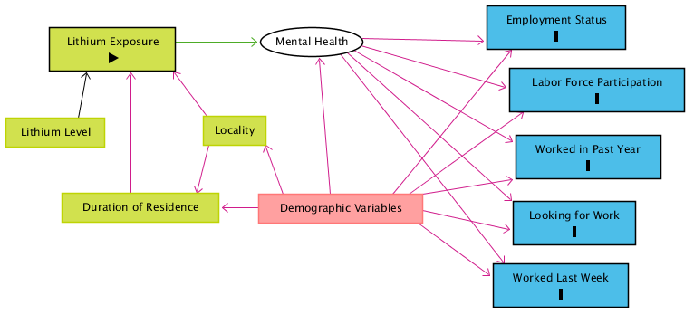

## Abstract

*This will be written after the completion of the paper.*

## Introduction

Lithium in groundwater has been used as a treatment for bipolar disorder for over sixty years. A growing corpus has investigated this relationship and found both no correlation and significantly negative correlations between lithium in groundwater and the incidence of suicide. Some correlative evidence shows that its presence in areas' groundwater (in much lower concentrations than those used psychiatrically) is associated with decreased rates of suicide in those areas [Barjasteh-Askari 2020]. If truly present, the mechanism for this is unknown, though it is hypothesized that lithium may have a mood-regulating effect that tempers people's strongest emotional responses. If this hypothesis is true, the ingestion of trace amounts of lithium may also prevent the occurence of other events caused by heightened emotional responses, such as being fired or missing work for mental health reasons.

In this project, I first attempt to replicate previous correlative results of the negative correlation between lithium in groundwater and suicide rate. I then estimate the causal relationship of lithium in groundwater on labor market participation and absences.


## Methods

### Data Used

I linked data from four sources.

The replication of this portion of this project requires average lithium concentrations in groundwater at the county level, but the causal inference portion of this project requires average lithium concentrations at the level of Public-Use Microdata Areas (PUMAs). I used geospatial vector data to define the boundaries of these areas: the US Census Bureau's county shapefiles for counties and IPUMS-USA GIS Boundary Files for PUMAs.

For suicide rates, I used the Institute for Health Metrics and Evaluation's data on mortality rates at the county level for the years 1980 to 2014. 

For labor market participation, I used the IPUMS American Community Survey (ACS) data. I selected the yearly samples between the years 2005 and 2018. The data is limited to these samples because these are the samples for which the variable recording PUMA of residence is available.

For lithium concentrations in groundwater, I used data from the United States Geological Survey (USGS) Water Quality Portal from 1995 to present. It includes almost 100,000 lithium measurements in 2040 out of 3142 counties and 1573 out of 2351 PUMAs. 

The measurements taken at each site are not identical. Consequently, I used the average measurement at each site when calculating average lithium level in groundwater for a county or PUMA to avoid excessively weighting sites at which more measurements happen to be taken. To arrive at an average exposure per county or PUMA, I generated a grid of points over the entirety of the United States and used a modification of Shepard’s method of inverse distance weighting (IDW) to interpolate the lithium level at each of those points. The formula for the interpolated lithium value $z_j$ at grid-point $j$ is given by $$z_{j} = \sum_{i=1}^n\Big(\frac{R-d_{ij}}{R \cdot d_{ij}}\Big)^2 \cdot \sum_{i=1}^n z_i\Big(\frac{R-d_{ij}}{R \cdot d_{ij}}\Big)^2,$$ where $i$ corresponds to one of the $n$ lithium measurement sites within 100 kilometers of grid-point $j$, $d_{ij}$ is the distance between grid-point $j$ and measurement site $i$, amd $R$ is the maximum distance between grid-point $j$ and any of the set of measurement sites within 100 kilometers.

This interpolation procedure deserves some scrutiny, since it ignores the geohydrological processes by which lithium enters and spreads through an area's groundwater. Though there is no theoretical basis for the use of IDW to interpolate trace concentrations of substances in groundwater, more rigorously estimating the lithium levels in groundwater across the entirety of the United States is infeasible given the time constraints on this project and my utter lack of expertise in this area. Moreover, this procedure is used by the professional software package Groundwater Modeling System, which indicates that its accuracy may be sufficient for aggregation at the county- or PUMA-level. Collaboration with a specialist in groundwater hydrology might assist in the quantification of uncertainty associated with and inaccuracy introduced by this interpolation method.

```{r setup, include=F}
library(tidyverse)
library(sf)
library(data.table)

#####################
# import shapefiles #
#####################

# load PUMA shapefiles
pumas = st_read("../data/ipums_usa_data/geographic/ipums_puma_2010/ipums_puma_2010.shp")

# remove non-state PUMA shapes
pumas = subset(pumas, as.numeric(as.character(STATEFIP)) <= 56)

#######################
# import lithium data #
#######################

# read lithium data
interpolated_lithium_values = as.data.frame(read.csv("../data/lithium_water_data/interp_values.csv", 
                                                              stringsAsFactors = FALSE))
# turn geometry back into coordinates
coords_flat = unlist(strsplit(substr(interpolated_lithium_values$geometry, 3, nchar(interpolated_lithium_values$geometry) - 1), ', '))
interpolated_lithium_values$longitude = as.numeric(coords_flat[1:length(coords_flat)%%2 == 1])
interpolated_lithium_values$latitude = as.numeric(coords_flat[1:length(coords_flat)%%2 == 0])

# make sf object for "contains" calculation
interpolated_lithium_values_sf = st_as_sf(interpolated_lithium_values, coords = 3:4, crs = st_crs(pumas))

#################################
# calculate PUMA lithium levels #
#################################

# run contains calculation for average lithium level calculation below
grid_in_puma_list = st_contains(pumas, interpolated_lithium_values_sf)

# calculate average lithium level in each PUMA
for(puma_number_local in seq(nrow(pumas)))
{
  grid_points_in_puma = interpolated_lithium_values_sf[unlist(grid_in_puma_list[puma_number_local]),]
  pumas[puma_number_local, 'lithium_value'] = mean(grid_points_in_puma$lithium_value, na.rm = T)
}


```

Nonetheless, the results from this interpolation and averaging procedure are presented below.

```{r lithium_map, echo=F, warning=F}
ggplot(data = pumas) +
  geom_sf(aes(fill = lithium_value, color = lithium_value))
```


### Replication of Correlation Between Lithium in Groundwater and Suicide Rate

*The procedure I will use is still a little unclear to me. I may yet decide not to include this.*

### Estimate of Causal Relationship of Lithium in Groundwater on Labor Market Participation

Figure 1 presents a directed acyclical graph that models the causal relationships relevant to this research. The entity "Demographic Variables" includes variables such as age, sex, race, marriage status, presence of dependents, rural/urban status, and poverty status, which have a complex internal structure of causal relationships. The most questionable decision in the model presented is the lack of a causal relationship between any outcome variables and "Duration of Residence".



This model was used with a propensity score matching research design to identify the effect of lithium exposure on labor market participation and absence in the week prior to the survey. Those surveyed who moved into an area with high lithium levels in groundwater are considered treated. Those surveyed who moved into an area with low lithium levels are considered untreated.

This exposes an assumption that may be unfounded: I assume that the decision to move to an area is independent of the mental health outcomes associated with living in that area. I think it is unlikely that the cumulative effect of lithium in drinking water is large enough to influence a person's decision to move to a place with higher levels.

Deciding where to split the continuous variable of lithium concentration into a treatment level or an untreated level is somewhat thorny. According to the interpolation and averaging method I used to determine the mean exposure to lithium in each locality, the median PUMA has a mean lithium level of 14 mcg/L and the mean PUMA has a mean lithium level of 23 mcg/L. These serve as a useful lower bound for where to cut the treatment variable. The figure below shows the per-PUMA lithium level histogram.

```{r lithium_histogram, echo=F, warning=F}
ggplot(data = pumas) +
  geom_histogram(aes(x = lithium_value), binwidth = 5)
```

REVIEW1, REVIEW2, REVIEW3, and REVIEW4 emphasize that increased lithium levels are negatively correlated with incidence of suicide but neither they nor the papers they review give much guidance as to what levels count as "elevated". However, one exception is Schrauzer and Shrestha (1990), who suggest that a lithium concentration greater than 70 mcg/L is a high level. I follow this for my main result, but I test the robustness of my results to variation of this cutoff. 

With 70 mcg/L as the cutoff level for inclusion into the treatment group, the treatment map is presented below.

```{r treatment_map, echo=F, warning=F}
# make treatment variable per PUMA, lithium value > 70 mcg/l
pumas$treatment_value = (pumas$lithium_value > 70)

ggplot(data = pumas) +
  geom_sf(aes(fill = treatment_value, color = treatment_value))
```

## Results


### Replication of Correlation Between Lithium in Groundwater and Suicide Rate

The plot below shows the measurement sites laid on top of the counties of the US.

*I have not completed this replication for the rough draft.*


### Estimate of Causal Relationship of Lithium in Groundwater on Labor Market Participation

*I have not completed this estimate for the rough draft.*

The plot below shows the measurement sites laid on top of the PUMAs.


## Conclusion

*I do not yet have the final results from which I might usefully conclude anything.*

For the code used to generate my results and this paper, see <https://github.com/nfra/CausalInferenceCourseHomework/tree/master/ResearchProject>.

## References

*These will be managed with* `citation_package` *in the final draft.*

Barjasteh-Askari 2020
